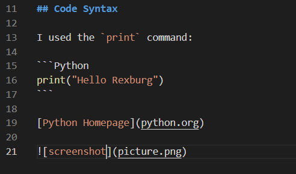

# Hello World Demo

This is my **hello world demo** software. It displays two words: Hello world.

This software was created to get practice using git and publishing to GitHub.

## Demo Video
Youtube: https://youtu.be/nVTN2bqsnlw

## Development Environment/Tools

* Python3
* Visual Studio Code
* Git

## Code Syntax

I used the `print` command:

```Python
print("Hello Rexburg")
```

[Python Homepage](python.org)



## Useful Websites
GitHub: https://github.com/devinpickle/HelloWorld.git